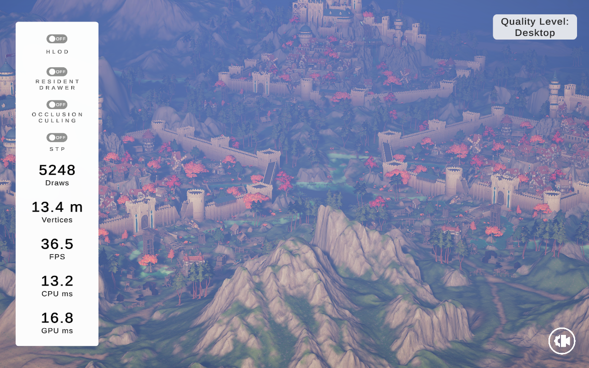
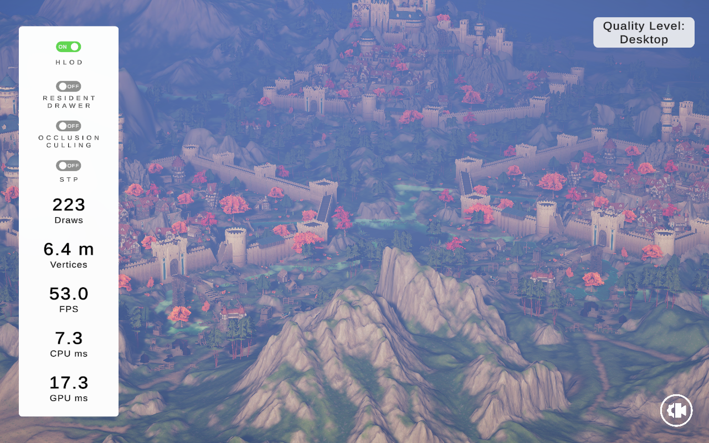

# Fantasy Kingdom HLOD Demo
This project serves as a demo of the [HLOD System][hlodRepo].
It is based on the [Fantasy Kingdom][fantasyKingdom] demo project.

Unity version:
```
6000.0.35f1
```
### Screenshots
The following screenshots and performance metrics were captured using a release build on a Steam Deck (LCD).
| HLOD Disabled  | HLOD Enabled |
| --- | --- |
|  | 

### License
Copyright (c) 2025 Unity Technologies ApS
Licensed under the Unity Companion License for Unity-dependent projects see [Unity Companion License][license].
Unless expressly provided otherwise, the Software under this license is made available strictly on an **“AS IS”** BASIS WITHOUT WARRANTY OF ANY KIND, EXPRESS OR IMPLIED. Please review the license for details on these and other terms and conditions.

[license]: <https://unity3d.com/legal/licenses/Unity_Companion_License>
[hlodRepo]: <https://github.com/NicoLeyman/HLODSystem>
[fantasyKingdom]: <https://unity.com/demos/fantasy-kingdom>
